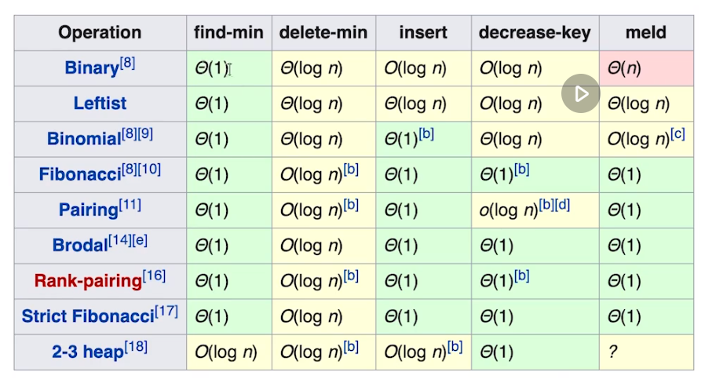

# 面试技巧--四件套

四步做题法:

1. 询问明确题意和一些边界约定
2. 考虑最优解
3. 编写代码
4. 测试 case

# 解题思路

首先可以考虑暴力法，然后思考优化，最后思考是否存在最优解。

# 二维的数据结构

典型的有树和图

## 树

是一种具有一个根节点，每个节点下都可以拥有子节点的结构。

一般把树中没有子节点的节点叫做叶子节点。

常见的有二叉树，红黑树等。

### 二叉树

即每个节点有且只有左右两个子节点的一种树结构。

### 基本的树代码框架

```js
class TreeNode {
  constructor(val) {
    this.val = val;
    this.left;
    this.right;
  }
}
```

### 二叉树的遍历

在遍历时由于树具有左右子树的存在，所以并不能直接的线性的遍历完，是一定需要分别分叉到子树中去搜索，所以根据遍历时先后顺序的不同分为：

1. 前序遍历，即根 -> 左 -> 右
2. 中序遍历，即左 -> 根 -> 右
3. 后序遍历，即左 -> 右 -> 根

### 二叉搜索树

在搜索一颗树时，如果树中元素绝对无序，那么我们就需要把全部元素访问一遍才能知道结果，是一个 O(n)的操作，此时树与链表基本一致，所以为了在效率上有所提升，可以在插入节点时增加逻辑使树中的元素相对有序，那么搜索起来就会有更快的效率，这就是二叉搜索树的思想；

**定义**

二叉搜索树是一个有序的树，其特征如下：

1. 左子树上的`所有节点的值`均`小于`它所在的根节点的值；
2. 右子树上的`所有节点的值`均`大于`他所在的根节点的值；
3. 以此类推的推广到每一个节点上。（重复性）

**效率**

查询：O(log n)

插入：O(log n)

删除：O(log n)

### 思考题

**树的面试题解法一般都是递归，为什么？**

因为树的形式就是通过父节点不断的派生出子节点，是一种层层嵌套的形式，每一个子节点想到于是父节点分解出的子问题，而递归则是把复杂的重复问题差分成单一的简单问题最后通过不断的重复来解决问题，所以这两种思想不谋而合，一个把复杂人物不断的派生出重复的子问题，一个是通过重复不断的解决子问题来解决复杂问题，可以说是天生的一对。

## 链表、树、图的关系

链表是特殊的只有一个子节点的树，树是特殊的没有环的图。

## 堆

堆是一种概念上的定义，只要是实现了定义的都可以称作为堆，具有多种实现方式，并非只有二叉堆一种。

**定义**

堆总是满足下列性质：

- 堆中某个结点的值总是不大于或不小于其父结点的值；
- 堆总是一棵完全二叉树。

其中将根结点最大的堆叫做最大堆或大根堆，根结点最小的堆叫做最小堆或小根堆。

**效率**

获取`最大值/最小值`时 O(1)

插入元素：慢的 O(log n) 快的 O(1)

删除元素：慢的 O(log n) 快的 O(1)

**二叉堆**

一般使用数组实现，面试中最常见，但是效率其实一般其插入和删除均为 O(log n)

**实现原理**

使用数组实现

假设数组中根元素索引为“0”，那么父子节点的关系如下：

1. 索引为 i 的左孩子节点为(2 \* i + 1)
2. 索引为 i 的右孩子节点为(2 \* i + 2)
3. 索引为 i 的父节点为(floor((i-1) / 2))

当插入元素时：

1. 先将元素插入到数组末尾
2. 然后将新插入的元素依次的与父节点对比，知道找到合适的位置，对比的过程叫做上浮

当删除元素时：

1. 将数组末尾的元素替换到堆顶
2. 然后将依次的与子节点对比，知道找到合适的位置，对比的过程叫做下浮

**堆的其他实现**



## 图

图在面试中的占比在减少，所以简要了解下。

图由点和边组成，同时表示方式分为邻接表和邻接矩阵两种表示方式。

邻接矩阵是由一个二维矩阵表示，其中横纵坐标均表示顶点的坐标，即 x = 2,y = 2 均表示顶点 2，而数组中存储的值则表示对应两个顶点间是否存在边，即[2,1] = 1 表示顶点 2 与顶点 1 存在边

邻接表是以数组+链表的方式表示，即数组的下标表示一个顶点，对应存储的值是链表的头指针，链表中依次存储的是与该顶点存在连接边的顶点的顶点下标

**有向无向**

指图中的边是否具有方向，即顶点 1 -> 顶点 2 存在边，但是反之顶点 2 -> 顶点 1 间不存在有效的边，类似于现实中的单向车道。无向则类似于双向车道，只要存在有效边，则双方都会存储。

**有权无权**

指图中的边是否有权重，权重代表了在遍历时的优先级，在邻接矩阵中权重记录在两个顶点相交的下标中。


无权

```
     0 1 2 3
0  [ 0 1 0 1 ]
1  [ 1 0 1 0 ]
2  [ 0 1 0 1 ]
3  [ 1 0 1 0 ]
```

有权

```
     0 1 2 3
0  [ 0 5 0 1 ]
1  [ 5 0 1 0 ]
2  [ 0 1 0 1 ]
3  [ 1 0 1 0 ]
```