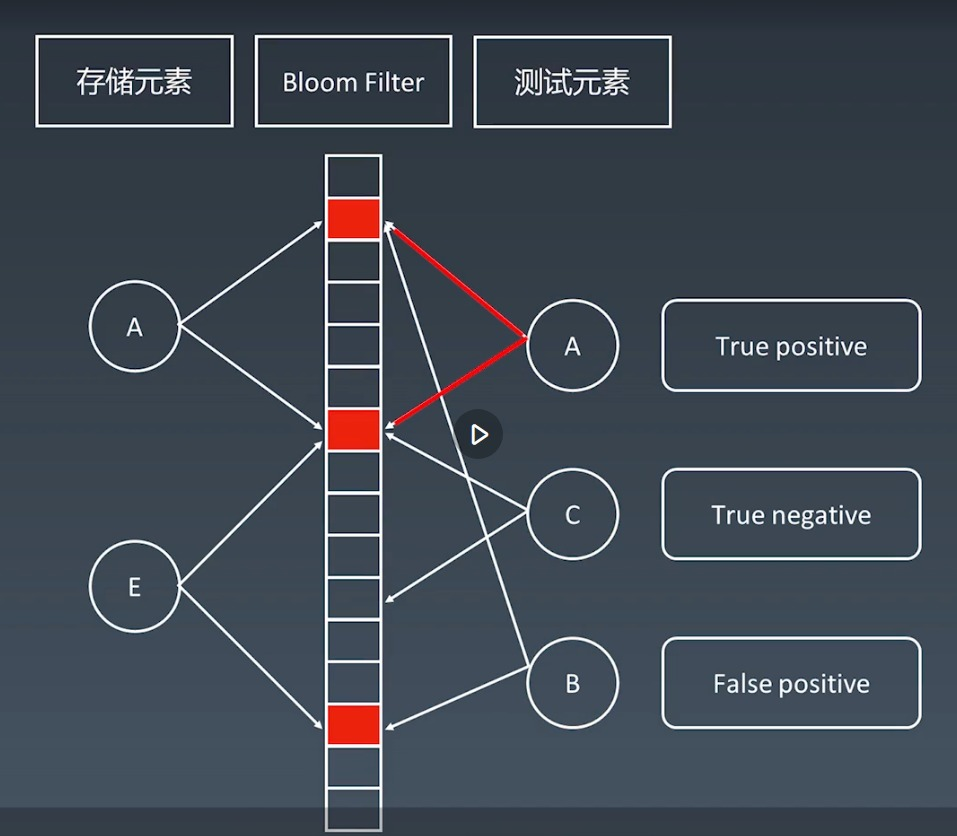
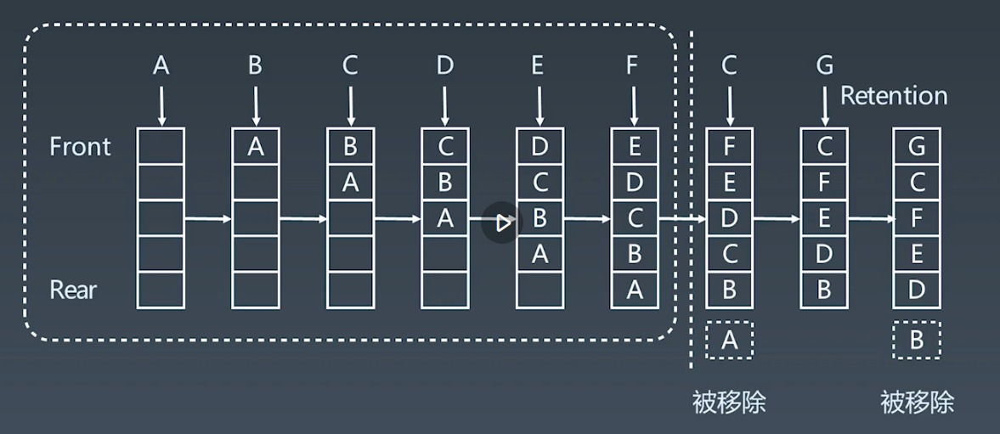
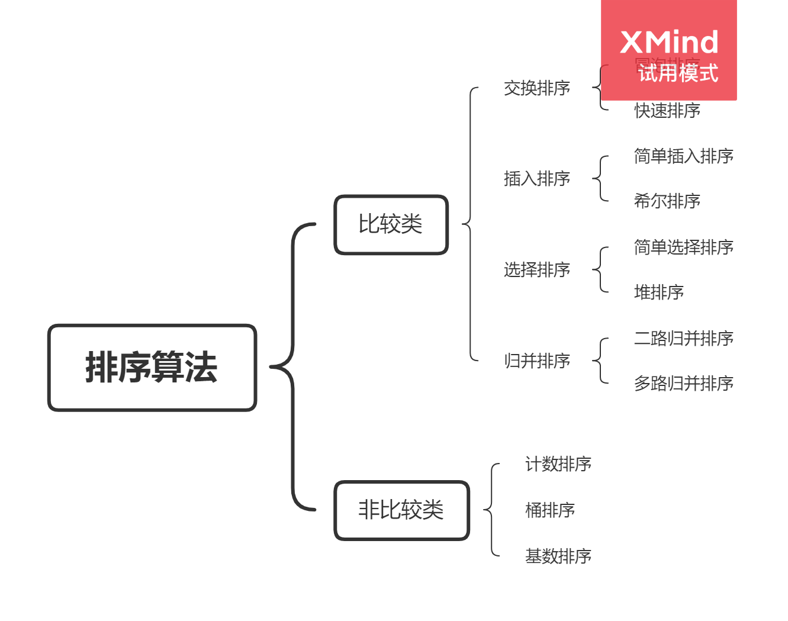

# 布隆过滤器

布隆过滤器的意义：在面对大量的数据时，使用较少的空间，极快的给出某一个元素是否有可能存在于集合中。

**原理**

使用一个很长的二进制向量（二进制数组）和一系列的随机映射函数来存储元素信息。

优点：空间效率和查询时间都远远超过一般算法。

缺点：不能准确的给出结果，有一定的识别误差以及删除困难。

一个元素（x、y、z）进入到布隆过滤器后会通过映射函数，映射为几个二进制位上，这就代表这个元素已经存储在布隆过滤器中了；

当要查询一个元素是否存在于过滤器中时，只需要把新元素（w）映射为二进制位，然后查看其中是否有值为 0 的位，如果有则必定不存在，如果没有则可能存在，此时再去到真正的存储空间中进行详细查询。

**为什么是有可能存在？**

与 hash 碰撞一样，不同的元素可能经过映射后的二进制位都为 1，像图中的 B 一样虽然这个元素可能不存在于过滤器中，但是会依然认为是存在的。

**既然不准确为什么还要用？**

布隆过滤器的意义在于放在服务的最外层来当一个缓存使用，也就是说如果缓存中都不存在了的话，那么就没必要浪费时间和性能去大量的数据中再查询一遍了，这样就可以滤掉很多不必要的操作。

**应用场景**

1. 比特币网络：快速查询某一个地址、节点是否在链中
2. 分布式系统
3. redis 缓存
4. 垃圾邮件、评论等过滤

**为什么不是 Hash Table（Map）**

因为哈希表在存储时可以在查找元素是否存在的同时存储很多元素的额外信息，这就导致了占用空间大，同时由于是离散模型，所以在内存中也不连续，面对大量元素时很难处理。

而布隆过滤器是使用二进制数组来存储的且仅存储是否存在于集合中这一信息，这样占用的空间就很小，同时内存连续查询起来也会高效很多。

# LRU 缓存

LRU（Least recently used，最近最少使用）算法根据数据的历史访问记录来进行缓存数据，其核心思想是“如果数据最近被访问过，那么将来被访问的几率也更高”。

使用 Hash Table + 双向链表实现。

复杂度：查询修改都是 O(1)。

**内在逻辑**

1. 新的数据被访问时插入到链表头部；
2. 命中缓存时，移动数据到链表头部；
3. 缓存满了时，将链表最后的元素丢弃；

**与其他缓存算法的区别**

主要是使用的数据结构与替换函数的思想不同，具体可以参考:[LRU 算法](https://www.jianshu.com/p/d533d8a66795)

# 排序

常见的排序可以分为两大类：

1. 比较类排序：通过比较来决定元素间的相对次序，由于其时间复杂度不能突破 O(nlogn)，因此也称为非线性时间比较类排序。
2. 非比较类排序：不通过比较来决定元素间的相对次序，它可以突破基于比较排序的时间下界，以线性时间运行，因此也称为线性时间非比较类排序。

emm...也想不出什么骚话，就直接记资料吧，回头慢慢看。

[十大经典排序算法（动图演示）](https://www.cnblogs.com/onepixel/p/7674659.html)

# 